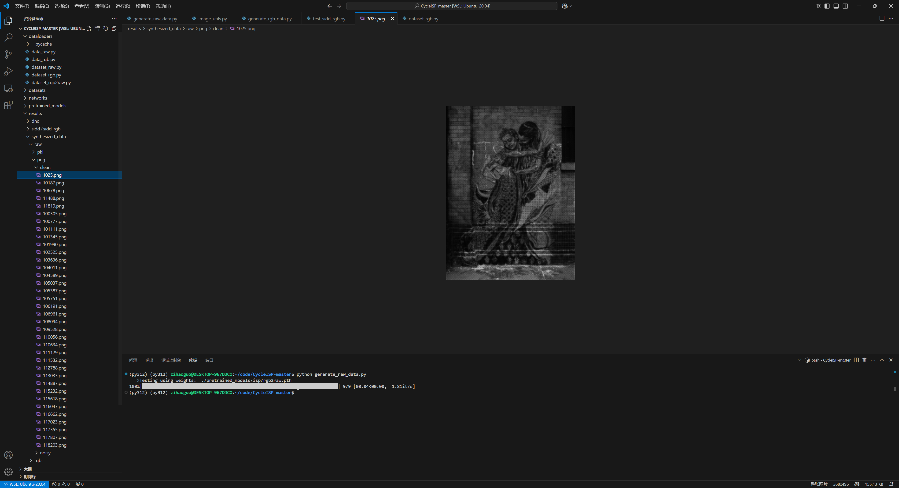

- # CycleISP 论文复现项目指南

  本项目旨在复现 **CycleISP: Real Image Restoration via Improved Data Synthesis** (CVPR 2020) 论文中的核心工作。CycleISP 通过改进的数据合成方法，实现了高质量的真实图像恢复。

  本指南将引导您完成数据合成、模型评估等步骤。

  **模型结构**

  

  ## 1. 数据合成 (Data Synthesis)

  在这一步，我们将使用 CycleISP 的框架来合成成对的训练数据。

  - **第一步**: 下载所有预训练的 ISP [模型](https://drive.google.com/drive/folders/1cHRfWPjFpTPrvBm7B4iTMEVZ4ABfjmxW?usp=sharing)，并将它们放置在 `./pretrained_models/isp/` 目录下。
  - **第二步**: 从 MIR-Flickr 数据集中下载一些示例 [图像](https://drive.google.com/drive/folders/1YyC3VerI51GXvncHHxrTLAoU4Ux1HACk?usp=sharing)，并将它们放置在 `./datasets/some_sample_images/` 目录下。

  #### 1.1 生成用于 RAW 降噪的数据

  此过程利用 `RGB2RAW` 网络分支，将输入的干净 sRGB 图像转换为干净的 RAW 图像。接着，噪声注入模块会向该 RAW 图像添加不同水平的散射噪声（shot noise）和读出噪声（read noise），从而生成成对的 `{RAW_clean, RAW_noisy}` 数据。

  - 运行演示

    ```
    python generate_raw_data.py
    ```

  

  #### 1.2 生成用于 sRGB 降噪的数据

  此过程以合成的带噪 RAW 图像作为输入，通过 `RAW2RGB` 网络分支将其映射为带噪的 sRGB 图像。这样，我们便可以为 sRGB 降噪任务生成所需的 `{sRGB_clean, sRGB_noisy}` 图像对。

  - 运行演示

    ```
    python generate_rgb_data.py
    ```

  

  ## 2. 模型评估 (Evaluation)

  您可以从这个 Google Drive [链接](https://drive.google.com/drive/folders/1GWAvtIqCfBewYNF14o_w2F6p03oMl3Dz?usp=sharing) 一次性下载 CycleISP 的完整仓库（包括预训练模型、数据集、结果等），也可以按照以下说明对单个任务进行评估。

  #### 2.1 DND 数据集 RAW 图像降噪

  - 下载预训练[模型](https://drive.google.com/file/d/1yjI3JtfC1IluGB0LRlnpPTAY_UyY9mG8/view?usp=sharing)，并放置于 `./pretrained_models/denoising/` 目录。

  - 下载 DND 的 RAW [图像](https://drive.google.com/drive/folders/15Bay1UJURlbP7kpS10_fJ96MxQ6B03Xv?usp=sharing)，并放置于 `./datasets/dnd/dnd_raw/` 目录。

  - 运行评估脚本

    ```
    python test_dnd_raw.py --save_images
    ```

  #### 2.2 SIDD 数据集 RAW 图像降噪

  - 下载预训练[模型](https://drive.google.com/file/d/1m2A4goZENg_kKV1-FJoeg1rBqLj6WRIm/view?usp=sharing)，并放置于 `./pretrained_models/denoising/` 目录。

  - 下载 SIDD 的 RAW [图像](https://drive.google.com/drive/folders/1invur2uE-QXHh-btHTZQetFcgjUAfbwc?usp=sharing)，并放置于 `./datasets/sidd/sidd_raw/` 目录。

  - 运行评估脚本

    ```
    python test_sidd_raw.py --save_images
    ```

  #### 2.3 DND 数据集 sRGB 图像降噪

  - 下载预训练[模型](https://drive.google.com/file/d/1740sYH7bG-c-jL5wc3e1_NOpxwGTXS9c/view?usp=sharing)，并放置于 `./pretrained_models/denoising/` 目录。

  - 下载 DND 的 sRGB [图像](https://drive.google.com/drive/folders/101AfVtkfizl20-XQ3leNt2cE_rI5ypeu?usp=sharing)，并放置于 `./datasets/dnd/dnd_rgb/noisy/` 目录。

  - 运行评估脚本

    ```
    python test_dnd_rgb.py --save_images
    ```

  #### 2.4 SIDD 数据集 sRGB 图像降噪

  - 下载预训练[模型](https://drive.google.com/file/d/1sraG9JKmp0ieLjntRL7Jj2FXBrPr-YVp/view?usp=sharing)，并放置于 `./pretrained_models/denoising/` 目录。

  - 下载 SIDD 的 sRGB [图像](https://drive.google.com/drive/folders/1JGoCXqHESBIocpDabk74mnee6RA3oCoP?usp=sharing)，并放置于 `./datasets/sidd/sidd_rgb/` 目录。

  - 运行评估脚本

    ```
    python test_sidd_rgb.py --save_images
    ```

  

  结果很抽象
