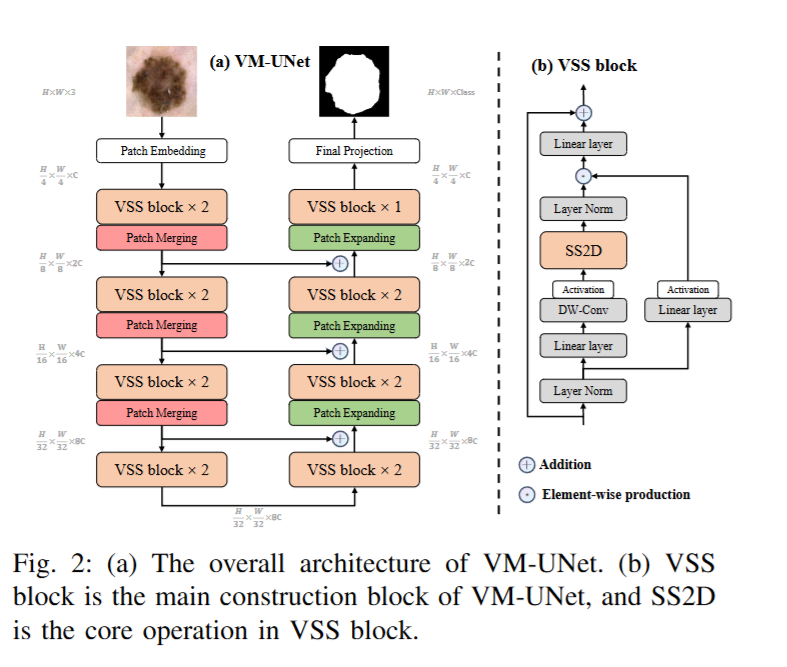
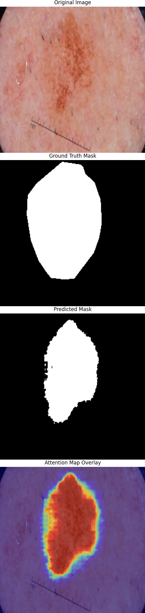

# VM-UNet 论文复现指南

本指南旨在帮助用户复现 **VM-UNet** 论文的实验结果。本文档提供了详细的环境配置、数据集准备、模型训练与测试的步骤。

## 源码链接

- **GitHub:** https://github.com/JCruan519/VM-UNet

## 模型结构



------

## 1. 环境配置

本复现项目在以下环境中测试通过：

- **操作系统:** Ubuntu 24.04 (基于 WSL 2)
- **深度学习框架:** PyTorch 2.8.0.dev2025xxxx (Nightly)
- **CUDA 版本:** 12.9.1
- **GPU:** NVIDIA GeForce RTX 5070 Ti (16GB 显存)

**依赖安装:** 在开始之前，请确保已安装所有必需的 Python 包。缺什么安什么

------

## 2. 数据集准备

### 2.1 ISIC 2017 & ISIC 2018 数据集

1. **下载:** 数据集（已按 7:3 比例划分训练集与验证集）可从以下链接下载：

   - https://pan.baidu.com/s/1Y0YupaH21yDN5uldl7IcZA?pwd=dybm
   - https://drive.google.com/file/d/1XM10fmAXndVLtXWOt5G0puYSQyI2veWy/view?usp=sharing

2. **文件结构:** 下载后，请将数据集解压并按下述结构存放于项目根目录下的 `./data/` 文件夹中。以 ISIC17 为例：

   ```
   ./data/isic17/
   ├── train/
   │   ├── images/
   │   │   ├── xxx.png
   │   │   └── ...
   │   └── masks/
   │       ├── xxx.png
   │       └── ...
   └── val/
       ├── images/
       │   ├── xxx.png
       │   └── ...
       └── masks/
           ├── xxx.png
           └── ...
   ```

### 2.2 Synapse 数据集

1. **下载:** 您可以参考 [https://github.com/HuCaoFighting/Swin-Unet](https://github.com/HuCaoFighting/Swin-Unet) 的方式下载并预处理该数据集，或通过以下链接直接下载处理好的版本：

   - https://pan.baidu.com/s/1JCXBfRL9y1cjfJUKtbEhiQ?pwd=9jti)

2. **文件结构:** 下载后，请将数据集存放于项目根目录下的 `./data/Synapse/` 文件夹中，并确保文件结构如下：

   ```
   ./data/Synapse/
   ├── lists/
   │   ├── list_Synapse/
   │   │   ├── all.lst
   │   │   ├── test_vol.txt
   │   │   └── train.txt
   ├── test_vol_h5/
   │   ├── case00xx.npy.h5
   │   └── ...
   └── train_npz/
       ├── case00xx_slice000.npz
       └── ...
   ```

------

## 3. 预训练权重

为了获得更好的性能，模型需要加载预训练的 VMamba 权重。

1. **下载:** 权重文件可从以下链接获取：
   - https://pan.baidu.com/s/1ci_YvPPEiUT2bIIK5x8Igw?pwd=wnyy
   - https://drive.google.com/drive/folders/1tZGs1YFHiDrMa-MjYY8ZoEnCyy7m7Gaj?usp=sharing
2. **存放路径:** 下载后，请将权重文件（例如 `.pth` 文件）存放到项目根目录的 `./pretrained_weights/` 文件夹中。

------

## 4. 模型使用

### 4.1 训练模型

根据您使用的数据集，执行相应的训练脚本：

- **在 ISIC17 或 ISIC18 数据集上训练和测试:**

  Bash

  ```
  python train.py
  ```

- **在 Synapse 数据集上训练和测试:**

  Bash

  ```
  python train_synapse.py
  ```

#### **注意：权重保存问题**

在复现过程中发现，原作者代码中 `work_dir` 的默认设置可能导致权重文件无法成功保存。 原始代码: `work_dir = 'results/' + network + '' + datasets + '' + datetime.now().strftime('%A%d%B%Y%Hh%Mm%Ss') + '/'`

**解决方案:** 建议在 `train.py` 或相关配置文件中，将 `work_dir`修改为一个固定的路径，例如： `work_dir = 'results/VM-UNet/'` 修改后即可正常保存训练好的模型权重。

### 4.2 直接进行测试（推理）

如果您拥有已经训练好的模型权重 (`.pth` 文件)，可以跳过训练步骤，直接进行测试和图像分割。

1. **修改配置:** 打开 `config_setting.py` (或相关配置文件)。

2. 设置参数:

   - 将 `only_test_and_save_figs` 设置为 `True`。
   - 在 `best_ckpt_path` 中填入您训练好的模型权重文件的完整路径。
   - 在 `img_save_path` 中指定一个用于保存测试结果图像的文件夹路径。

3. 执行脚本:

    保存配置后，运行训练脚本即可启动测试。

   Bash

   ```
   # 同样使用训练脚本来启动纯测试流程
   python train.py
   ```

------

## 5. 查看结果

- **训练过程结果:** 训练日志、验证集指标以及保存的模型权重等，可以在您修改后的 `work_dir` 路径下找到（例如 `./results/VM-UNet-ISIC2017/`）。
- **测试分割图像:** 在推理模式下生成的分割结果图像，会保存在您于 `img_save_path` 中指定的路径下。

### **复现效果**

根据笔者的测试，该模型收敛速度快，仅训练一至两轮后，在验证集上即可达到非常出色的分割效果。


